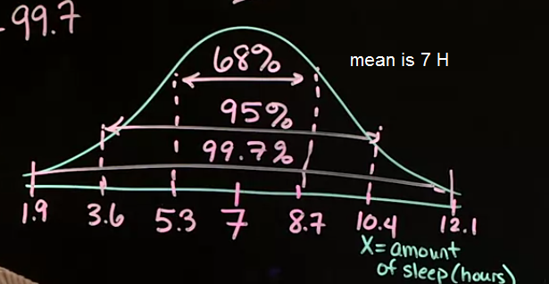
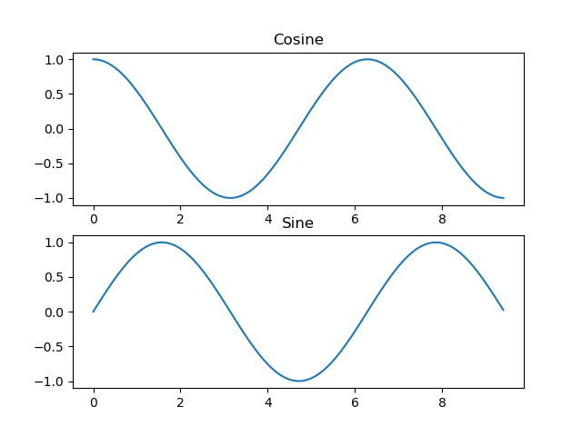

## First Week Theory : 
---

#### Numerical or Quantitative data :
	Continuous : float,  countiuous data type is kind of data that we can take an average of it like :
	e.g(weight, height, time, age, etc.)

	Discrete : int, kind of data that we cant take average of or the average of it is meaningless like : 
	e.g(1 for male and 2 for female the average of it is meaning less and dont proove anything.)

#### Categorical or Qualitative :
	Nominal : bool , str , None, kind of not numerical data consist of a group or names that dont inherit 
	or be ordered like : e.g(are you maried? the answer is yes or no so its not ordered or 
	inherited. or how you come to wark? car, bus, etc.)

	Ordinal : list , defined by how to use the data. its important in create visuals, kind of data that
	consist of a group or name that been ordered or ranked like : e.g(how much you saticfied of something?
	1.not satisfied, 2. .... etc.)the amount of satisfaction is ordered in numbers 1 to 5 so its ranked 
	and ordered so its ordinal data type.

---

#### categorical data chart : 
	best ways to visualize categorical data is frequency table and bar chart
**Note:** pie chart is not recomended because of the labelig and hard to recognize amounts without further information

#### Quantitative data chart : 
	one way to visualize quantitative data type is histogram its like
	bar chart but its not a bar chart. histogram have 4 main aspect :

* shape
* center
* spread
* outliers
---

## Second Week Theory :

#### Mean : 
our typical average calculation e.g(12, 45, 12, 32, 21 . mean= (12+45+12+32+21)/5=122)

#### Median : 
middle number in list is median e.g(12, 45, 65, 32, 21 . median= 12, 21, 32, 45, 65=32)the list should arrange from lowest to highest number.

#### Standard Diviation(SD) : 
average distance of values from the mean called standard diviation or sd

**calculation:**
1. calculate the mean
1. subtract the mean by all of the numbers and pow by 2
1. calculate the mean of the squared 
1. take the square root of the number
*example:* 1, 2, 5, 8, 7
1. mean = (1 + 2 + 5 + 8 + 7) / 5 = 4.6

2. 
(1-7)<sup>2</sup> = 36 **,** (2-7)<sup>2</sup> = 25 **,** (5-7)<sup>2</sup> = 4 **,** (8-7)<sup>2</sup> = 1 **,** (7-7)<sup>2</sup> = 1

3. mean = (36 + 25 + 4 + 1 + 1) / 5 = 13.4

4. 
square root = √13.4 = 3.66

#### Bell Shaped and Empirical Rule : 
its a shape that show the up and down in values in chart. 
the mean of the data is in the upper place of the bell shaped so if move one SD from each side of the mean, by the rule this teritory contain 68% of the statistics. if we choose two sd from each side of the mean we we nearly have 95% of statistics and if we move three sd's we almost have 99% of statistics.





##### **Standard Score** :
standard score is a score that someone cant get from calculating their data with the empirical rule.
**Formula:** (observation - mean) / SD
*Example:* the mean of sleep is 7 hour and sd is 2. I sleep 8 hour a day so :
observation : 8, mean : 7, SD : 2
```math
(8 - 7) / 2 = 0.5 
```
so I sleep 0.5 above than mean if the resault was minease my sleep was below the mean. so my standard score is 0.5.


##### Five Number Summary : 
are five numbers that we can get from plot or directly from data itself that summarize the plot.

**Five numbers are :**
* Min : minimum
* Q1 : first quartiles that is 25% of data
* Median : median of the data 
* Q3 : third quartiles that is 75% of data
* Max : maximum

#### BoxPlot : 
its kind of visualizing options. its vizualizing data specially the five number summary in itself.

*IQR* : the box is sized as IRQ (inter quartiles Q3 - Q1 = IRQ).

*median* : the meadian is a line at the middle of the box.

*Q1, Q3* : the Q1 and Q3 are at the edge of the box lines.

*min, max* : two vertical lines out of the box linked to the box with two horizontal lines named *whisker* that are min and max.

*outliers* : are usually dots in the rest of the line of the whisker

***Important Note:*** sometimes thay show the outliers in the boxplot as dot and sometimes they just expan the whiskers of min and max to the greatest and lowest valuein the plot.

**formula to calculate min of the boxplot when we show the outliers as dot:** Q1 - 1.5 * IQR
**formula to calculate max of the boxplot when we show the outliers as dot:** Q3 + 1.5 * IQR


**Note :** box plots are unable to show the data shape really good like histograms but thay are good at time we want to compare lots of observation.

---
**Note:** when the shape is right skewed the median is greater then mean and when its left skewed the mean is greater then median when we have bell shaped mean and median are equal.


## Third Week Of Theory:

#### Association Types :
* Linear association
	* the pattern shows by line
* Quadratic association
	* the pattern is parabolic
* No association
	* there is no pattern 

#### Association Direction :
* positive linear association 
	* when x increases y increases
* negative linear association
	* when x increases y decreases

#### Association Strength :
* weak linear association
	* points are largely scattered from the line
* moderate linear association
	* points are partially scattered from the line
* strong linear association
	* points are minimally scattered from the line
**Note:** the direction of line is not affect the strength(we have strong + and strong -)

# numpy :

>``np.mean(arr, axis=0)``
>
> **return the average of the array (in 1 dementional arrays) if there is no axis. if we have axis return mean of column in axis=0 and mean of rows in axis=1.**


>``arr.shape``
>
> **return the shape of array as a tuple for example: arr = [[1, 2], [3, 4]] the resualt of arr.shape is : (2, 2)**


>``np.array([1, 2, 3])``
>**make an array with  the passed value the data type is numpy.ndarray**


>``np.zeros((2, 3))``
>
>**make a array with value of zero in the size that given(2 rows and 3 columns)**


>``np.ones((2, 3))``
>
>**make a array with value of one in the size that given(2 rows and 3 columns)**


>``np.full((2, 3), 8)``
>
>**create an array with value of 8 in given size**


>``np.random.random((2, 3))``
>
>**give us an array of random number between 0 and 1 in the given size**


>``arr.dtype``
>
>**return the datatype of array**
>**Note:** unlike python list numpy arrays cant have diffrent datatypes in itself.


>```np.add(arr1, arr2), do the '+' operator
" .subtract " do the '-' operator
" .multiply " do the '\*' operator
" .divide   " do the '/' operator
" .sqrt(arr)" return the root square root of the array values
>```


>``np.sum(arr, axis=0)``
>
>**if it be without axis return the sum of all of the array values but with axis if the axis is 0 it return the sum of columns if the axis is 1 it return the sum of rows.**


>``np.arange(start, stop, step, dtype=datatype)``
>
>return an array with given values. start is start of array range.

#### accessing the multidimensional arrays values by index:
to acces the values by index for the regular arrays or one dimensionals use the standards like : a[0]
but in multi dimensional arrays use tha row and column index for example:

`arr = [
	[1, 2],
	[3, 4],
	[5, 6]
]`

to access '2':
* `arr[0, 1]`

to access '5':
* `arr[2, 0]`


# pandas : 

>`pd.set_option('display.max_columns', 100)`
>
>**when you have dataframe with lot of data, pandas put a '...'in the middle of your data and make your columns smaller with this command you can tell it to dont do that.**

>`df.head()`
>
>**return top 5 data row in the dataframe if you pass a number you got [that much df.head(10)]**


>`df `
>
>**show the whole dataframe**


>`df.columns` 
>
>**return columns header**

>`df.dtypes`
>
>**return all columns data type (int64, object, float64, etc.)**

		
>`df.columnName.unique()`
>
>**remove the reaped values an dshow the result**


>`df.groupby(['first column', 'second column', etc.]).operation()`
>
>**it compare two columns and make a group based on it and do the operation on it e.g(df.groupby(['Gneder', 'GenderGroup']).size()) this will return the size of each group and there are two groups.**


>`df.shape`
> 
>**return the shape of the data frame e.g((500, 10) this data frame have 500 rows and 10 columns).**


>`df.max()`
> 
>**return max number of all of columns in data frame**
>**if we call it on specific part of data frame get that specific part not all of the columns**


>`df.min()`
>
>**its work unlike the max() but in same rule and syntax**
### selecting specific data :

>`df.loc[rowRange, "column name"]`
>
>**return all of the datas under column name in the given range e.g (df.loc[0:10, "Weight"] or df.loc[:, "Weight"] return all under weight) or you can return multiple columns by giving an list to it e.g(df.loc[0:10, ['Weight', 'Height', 'id']])**


>`df.iloc[range of rows, range of columns]`
>
>**its an integer based locator take two args first arg is range of rows to show (like loc) and the second is range of columns to show e.g(df.iloc[:10, 0:3]) this should return 10 rows and three first columns or you can give a list of rows (like loc) or columns(not like loc) to it e.g(df.iloc[:10, [2, 5, 6, 10]]) return the given column number data.**
#### ways to select data
* `df['columnName']`
* `df.columnName`
* `df.loc[range, 'columnName']`
* `df.iloc[range, columnRange]`
		

>`df.ColumnName.value_counts()`
>
>**return two columns first is all of the values under the named column and the second one is the frequency of that value. like :**
yes		202
no 		106
202 people answered yes and 106 answered no.

>`df['ExistsColumnName'] = df.ExistsColumnName.fillna('NewValueThatContainNullValues')`
>
>**in the value_counts() panda ignore the null values and dont show them in the statistics we can get the null with fillna and set them to a value manualy. so the pandas considere them in the value_counts()**

>**make a new column named DMDEDUC2x and replace the DMDEDUC2 values with the given dictionary and add it to the new column.**
```python
da["DMDEDUC2x"] = da.DMDEDUC2.replace({1: "<9", 2: "9-11", 3: "HS/GED", 4: "Some college/AA", 
									   5: "College", 7: "Refused", 9: "Don't know"})
da.DMDEDUC2x.value_counts()
``` 

# matplotlib :
**Note :** matplotlib plot modules are in matplotlib.pyplot . so we :
```python
import matplotlib.pyplot as plt 
```
to import them.


>`plt.plot(x, y)`
>
>**make plot with given x and y axis but dont show it its just make the plot object.**


>`plt.show()`
>
>**show the plot that you made the object of it before this.**

>`plt.xlabel('label name')`
>
>**put a label name for x axis label is just a name that show in the plot.**

>`plt.ylabel('label name')`
>
>**put a label name for y axis label is just a name that show in the plot.**

>`plt.title('a title name')`
>
>**its just a title name that show in the plot presentation.**

>`plt.legend(['first legend', 'second legend'])`
>
>**its a legend for the plot for user to understand the plot better.**

>`plt.subplots(nrows, ncolumns, arrengment)`
>
>**make a subplot it means that you can put two small plots and show them as one plot like :**


